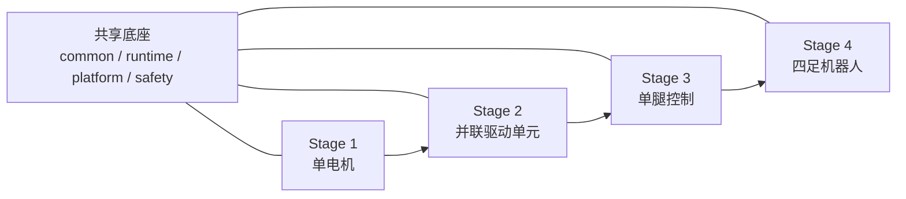

# 仓库架构设计

## 1. 目标

这个仓库不是把四个项目拼在一起，而是沿着同一条控制主线逐级生长：

- `Stage 1` 验证单个执行器可控
- `Stage 2` 把多个执行器抽象成一个并联驱动单元
- `Stage 3` 在驱动单元之上形成单腿控制
- `Stage 4` 由四条腿组成完整四足机器人控制系统

核心思想是：每一级都只是“在前一级之上增加一层能力”，不重写通信、不重写安全、不重写日志。

## 2. 总体视图

## 3. 目录职责

### `src/`

- `common`：基础类型、单位约定、轻量工具、通用打印/日志接口
- `runtime`：控制循环驱动、任务调度、状态切换、运行上下文
- `platform/phyarc`：对接厂商 SDK，屏蔽底层通信细节
- `model/motor`：单电机模型、参数、标定结果
- `model/drive_unit`：并联驱动单元的传动关系、耦合与映射
- `model/leg`：单腿几何、运动学、雅可比、腿空间约束
- `model/quadruped`：机身和四腿拓扑、腿编号、支撑相定义
- `control/motor`：电机级控制器
- `control/drive_unit`：并联驱动同步、分配、等效输出控制
- `control/leg`：关节空间/足端空间控制
- `control/quadruped`：全身控制、步态调度、腿间协调
- `safety`：限位、急停、降级、故障传播

### `stages/`

每个阶段都保留三类内容：

- `app`：该阶段可独立启动的入口
- `config`：默认参数和硬件映射
- `tests`：该阶段最小验证集合

这样做的好处是：每一级都能单独 bring-up，也能清楚看到“从哪里长到下一阶段”。

### `third_party/`

- 固定放厂商 SDK、外部依赖、原始示例
- 原则上不把业务逻辑写在这里
- 如果必须补丁，优先在 `src/platform/phyarc` 里做适配，尽量不直接改 vendor 原码

### `docs/`

- `hardware`：原始手册、接线、通信说明
- `mechanism`：机构学和建模资料
- `architecture.md`：仓库结构与演进规则

## 4. 四级递进定义

| 阶段 | 核心目标 | 主要输入 | 主要输出 | 升级到下一阶段前必须稳定的能力 |
| --- | --- | --- | --- | --- |
| Stage 1 单电机 | 打通最小闭环 | 电机参数、网络配置、控制模式 | 位置/速度/电流闭环、PVCT 日志 | 能可靠控制单电机，具备安全限幅和日志 |
| Stage 2 并联驱动单元 | 把多个电机抽象成一个驱动单元 | 电机组配置、耦合关系、分配规则 | 单元级位置/速度/力矩输出 | 同步控制、故障隔离、等效输出一致 |
| Stage 3 单腿控制 | 建立从驱动到腿的映射 | 连杆参数、关节零位、运动学模型 | 关节空间与足端空间控制 | 正逆运动学、轨迹跟踪、腿级保护 |
| Stage 4 四足机器人 | 建立整机协调控制 | 机体参数、腿拓扑、步态参数 | 行走/站立/切换控制 | 状态估计、步态调度、整机安全状态机 |

## 5. 开发规则

### 规则 1：先封装适配层，再写控制器

`src/platform/phyarc` 负责把厂商接口整理成项目内部统一接口。上层控制器不直接散落调用 SDK。

### 规则 2：模型层先于控制层

每一级在写控制器前，先定义对应层级的“被控对象模型”：

- 单电机先有电机参数和反馈结构
- 并联单元先有传动比、耦合关系、故障归属
- 单腿先有连杆几何和雅可比
- 整机先有机身-四腿拓扑和坐标系

### 规则 3：每一级都要有可运行入口

即使只是最小程序，也必须能从 `stages/<stage>/app` 直接启动。这样才能避免“库很多，但没有集成验证入口”。

### 规则 4：配置跟着阶段走

硬件映射和调参项优先放在对应 stage 目录下，而不是全塞进一个全局配置文件。这样更方便阶段隔离和迭代。

### 规则 5：测试目标要和阶段目标对齐

- `Stage 1` 重点是通信、控制模式、闭环稳定性
- `Stage 2` 重点是同步性、一致性、故障隔离
- `Stage 3` 重点是运动学正确性、轨迹误差、腿级保护
- `Stage 4` 重点是状态切换、步态稳定性、整机容错

## 6. 建议的开发顺序

1. 先在 `Stage 1` 做统一电机接口和日志结构。
2. 再在 `Stage 2` 抽象出 `ParallelDriveUnit`。
3. 接着在 `Stage 3` 定义 `SingleLegPlant` 和 `LegController`。
4. 最后在 `Stage 4` 引入整机状态机、步态与协调控制。

## 7. 当前仓库中的资源位置

- 厂商 SDK：`third_party/phyarc/linux_sdk`
- 厂商手册：`docs/hardware/phyarc/manuals`
- 单腿机构文档：`docs/mechanism/single_leg_mechanism_kinematics.docx`

## 8. 与已跑通单电机工程的映射关系

你已有的 `single_motor_ctrl` 参考工程，说明 `Stage 1` 的真实最小闭环已经验证过。建议把它作为 `Stage 1` 的种子工程，但不是整仓库的最终目录模板。

推荐映射如下：

| 参考工程目录 | 建议迁入位置 | 原因 |
| --- | --- | --- |
| `include/device` / `src/device` | `src/platform/phyarc` | 这里直接依赖板卡上下文和主板连接，属于硬件适配层 |
| `include/driver` / `src/driver` | `src/platform/phyarc` | 这里直接封装 `RobotMotor` 和 SDK 调用，仍属于平台层 |
| `include/domain/motor_types.h` | `src/model/motor` | 电机配置、遥测和状态是电机模型定义 |
| `include/domain/single_motor_controller.h` / `src/domain` | `src/control/motor` | 这是典型的单电机控制器 |
| `include/control/safety_manager.h` / `src/control/safety_manager.cpp` | `src/safety` | 安全逻辑应独立于具体控制层 |
| `include/control/telemetry_monitor.h` / `src/control/telemetry_monitor.cpp` | `src/runtime` | 反馈采集和监视更接近运行时能力 |
| `include/common/config_loader.h` / `src/common/config_loader.cpp` | `stages/stage1_single_motor/config` 或后续 `src/runtime` | 前期可先保留 stage 内，后续复用时再上提 |
| `src/app/cli_app.cpp` / `src/main.cpp` | `stages/stage1_single_motor/app` | 这是阶段级入口，不应混入共享库 |

这份映射的关键点是：把“能复用到 Stage 2~4 的东西”提前沉到共享底座，把“只属于单电机调试的入口和配置”留在 `Stage 1`。

